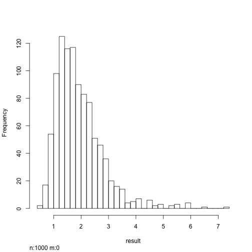
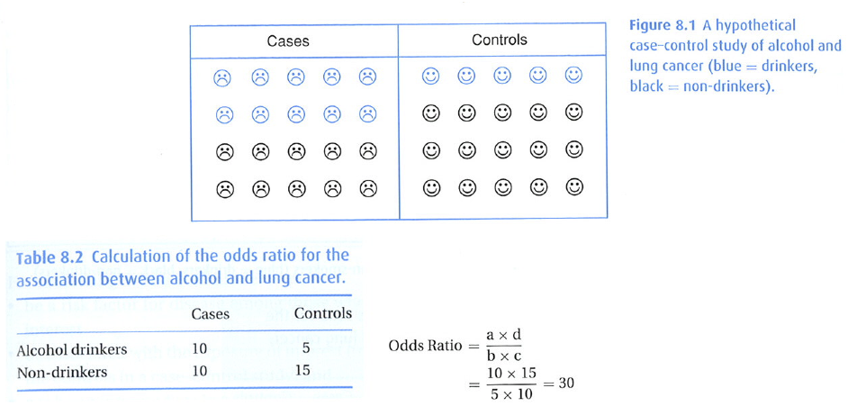
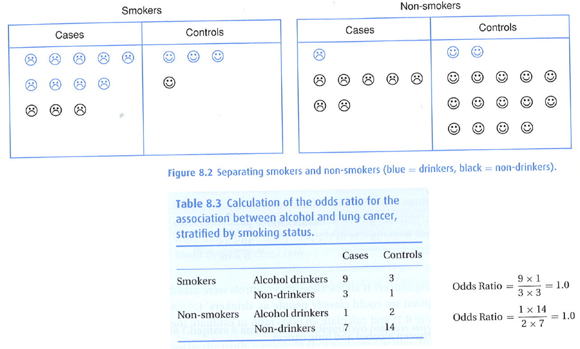

Epidemiology Notes 2012-10-16
=====================


Reminders:
------------
* Contagion Movie on Thursday evening
* Mid-term exam next Tuesday.  Just 45 minutes.

In the News
------------
* [Meningitis outbreak](http://www.nytimes.com/2012/10/16/health/wider-meningitis-risk-from-tainted-drugs-feared.html?_r=1&hp) How can you tell the case definition didn't include being prescribed a particular drug?
* [Influenza vaccine](http://www.cidrap.umn.edu/cidrap/content/influenza/general/news/oct1512ccivi.html)


Quiz on Confounding
-------------------

[Paper document here](../Activities/quiz-2012-10-16)

1. What's the difference between precision and accuracy?
2. What's confounding?
3. Give a textbook example of confounding.
4. Give an example of confounding from your own experience.

Today's Theme: Precision and Accuracy
---------------------

One way to think about accuracy is in terms of bias.  The book describes several forms of sampling bias.  

Example: How many of you are intravenous drug users?  

Other examples:
* In traditional telephone polls, respondants are more likely to be democratic.
* In mail (SPO) polls at Macalester, females are much more likely to respond.
* Recall bias: people tend to think they ate more healthily.  Cruciferous vegetables and tomatoes interaction in Queensland study of meat cooking and prostate cancer.


Odds Ratios and Logarithms
------------------------

Suppose you had two different studies, each of which produces an odds ratio different from 1, but where the two different studies have opposite conclusions.


#### Study 1

        | Cases  | Controls
--------| ------ | --------
Exposed |   10   |    5
Not     |    5   |   10

Odds Ratio: 4

#### Study 2

        | Cases  | Controls
--------| ------ | --------
Exposed |   5    |   10
Not     |   10   |    5

Odds Ratio: 1/4

#### Combine the two Studies

        | Cases  | Controls
--------| ------ | --------
Exposed |   15   |   15
Not     |   15   |   15

#### Average the two odds ratios

$(4 + 1/4)/2 = 2.125$

There's a bias to be larger than 1.  We can remove this bias by using logarithms.

Construct a table of logarithms base 10

Construct a table of logarithms base 2

Show that the average works on the log table.


Confidence Intervals and p-values
===================

You have to have just a little bit of statistics to make sense of the literature.  Some of you have already had quite a bit, for instance Math 155.  That gives you the technical skills you need.  We're going to talk about concepts but give you one technical skill that will help a lot.

### Standard Errors

* Confidence intervals generally.
    *The idea of a coverage interval.  95% is typically chosen.  Use galton height data to get a confidence interval on the sample mean.
    *Sampling distribution. Show how to simulate this.
* Confidence intervals on LOG odds ratios.  $2 \times \sqrt{1/a +1/b + 1/c + 1/d}$
* Use the data created by 

```r
# Demonstrations of the construction of confidence intervals and
# hypothesis testing.
energy = c(rep("High", 520), rep("High", 510), rep("High", 210), rep("High", 
    90), rep("Low", 100), rep("Low", 150), rep("Low", 600), rep("Low", 390))
activity = c(rep("Active", 520), rep("Active", 510), rep("Lethargic", 210), 
    rep("Lethargic", 90), rep("Active", 100), rep("Active", 150), rep("Lethargic", 
        600), rep("Lethargic", 390))
condition = c(rep("Disease", 520), rep("Control", 510), rep("Disease", 210), 
    rep("Control", 90), rep("Disease", 100), rep("Control", 150), rep("Disease", 
        600), rep("Control", 390))
tab8.4 = data.frame(energy = energy, activity = activity, condition = condition)

# odds ratio from a 2x2 table with condition along the 2nd (horizontal)
# axis
odds.ratio = function(t) {
    return((t[1, 1]/t[2, 1])/(t[1, 2]/t[2, 2]))
}
```


### Activity: Analyzing your random sample

Here are a bunch of random samples prepared for the class, each with a sample size of 100.  Have each person calculate an odds ratio. Then let's compare them.

[Tables to hand out](Activities/conf-interval-tables.pdf) --- first page --- cut these up and give each student one.


Now have each student calculate the confidence interval on the log odds ratio and translate that back into a confidence interval on the odds ratio itself.

Then do it for the whole data set

```r
with(tab8.4, table(activity, condition))
```

```
##            condition
## activity    Control Disease
##   Active        660     620
##   Lethargic     480     810
```

```r
2 * sqrt(1/660 + 1/620 + 1/810 + 1/480)
```

```
## [1] 0.1606
```

```r
log(odds.ratio(with(tab8.4, table(activity, condition))))
```

```
## [1] 0.5858
```

```r
exp(0.5858 + c(-1, 1) * 0.1606)
```

```
## [1] 1.530 2.109
```


### Automating the process

```r
odds.ratio(with(tab8.4, table(activity, condition)))
```

```
## [1] 1.796
```

```r
# Working with a sample of size 100
mysamp = sample(tab8.4, size = 100)
with(mysamp, table(condition))
```

```
## condition
## Control Disease 
##      51      49 
```

```r
# Construct the sampling distribution from the population
s = do(1000) * odds.ratio(with(sample(tab8.4, size = 100), table(activity, condition)))
hist(s)
```

 

```r
# Construct the resampling distribution from the sample itself
s = do(1000) * odds.ratio(with(resample(mysamp), table(activity, condition)))
hist(s)
```

 

```r
qdata(c(0.025, 0.975), s$result)
```

```
##   2.5%  97.5% 
## 0.6168 3.2866 
```

* The standard error and the funnel plot: looking at lots of studies and comparing their odds ratios and standard errors: Start at time 9:30 in [http://www.ted.com/talks/ben_goldacre_battling_bad_science.html this TED video]
* Hypothesis testing.  p-values.
    * Same sort of analysis but create a sampling distribution under the Null Hypothesis and ask how likely the observed value is.
    *Constructing the conditional sampling distribution by randomizing the explanatory variable.
*The abuse of p-values and significance.  Multiple comparisons.  Hand out [lists of p-values](Activities/conf-interval-tables.pdf) pages 2 and 3

* Julie Hoffer's study of leafy green vegetables and E. coli odds ratios.
    * [Link to cross-tabs and ORs](Leafy-Green-Odds-Ratios.pdf)
    * How were the controls collected
    * Computation of confidence intervals
    * Importance of taking the CI into account: nothing seems particularly protective against E. coli.  For those that are close to the cut-off, remember to do the multiple tests adjustment.
    * What would happen if we could increase the number of controls?  Would this help improve the estimate?

* Meta-analysis.  Advantages and problems (publication bias leading to not all studies being reported).
* Sample size and power.


### Power
How big would the study need to be to keep the confidence intervals well away from log odds of 0.

Confounding
---------------

Examples ...

### Made up example from the book.  ("Imagine a (very small) case-control study ...")





### Life vests and drowning

Coast guard study during Carter administration.  Is it cost-effective to have a government regulation requiring life vests on passenger ships.  Go to records of man-overboard and look at the fraction who drowned with and without life vests.

          | Drowned    | Saved
----------|------------|----------------
Vest      |    71      |   29
No Vest   |    29      |   71

Odds Ratio: 6:1

95% confidence interval: 3.2 to 11.2

So the result is precise enough, even if it's based only on 100 cases.

But there is a confounder.

Sea State | With Vests | Without Vests
----------|------------|----------------
Calm      |   1/10     |  20/90
High Waves|   70/90    |  9/10
TOTAL     |   71/100   | 29/100


Diagram
<pre>
Vest  - - - - > Drowning
  ^                 ^
  |                 |
Weather ---->-------|  
</pre>


### Smoking and Death

Study of female voters in Whickhamshire, England.  Interviewed voters and recorded whether or not they smoked.  Followed up 20-years later to see who was still alive.  Here are the data.


```r
w = fetchData("whickham.csv")
```

```
## Retrieving from http://www.mosaic-web.org/go/datasets/whickham.csv
```

```r
with(w, table(smoker, outcome))
```

```
##       outcome
## smoker Alive Dead
##    No    502  230
##    Yes   443  139
```

```r
502 * 139/(443 * 230)
```

```
## [1] 0.6848
```


What does this odds ratio mean?  Keep in mind that the odds ratio refers to a particular layout of the table, with exposed in the top row and cases in the left column.  This has that backwards.  So the odds ratio of 0.68 means that smoker "No" is associated with low probability of being "Alive".

Easier to interpret if we put the columns and rows in the conventional order.  Then OR > 1 means "exposure is associated with case status".  In other words, smoker is associated with lower probability of dying.

We can ask for a confidence interval on this odds ratio

```r
exp(log(0.6848) + c(-2, 2) * sqrt(1/502 + 1/230 + 1/443 + 1/139))
```

```
## [1] 0.5326 0.8805
```


Therefore, we have a statistically significant protective value of smoking on dying.

But there is a confounder: age

<pre>
Age -> Dying
  |     /  
Smoking/
</pre>

### Charter Schools

Research into whether charter schools provide superior outcomes to public schools.

Method: Lottery randomly assigned applicants to charter schools or to remain in public schools.  Standardized tests used to compare the charter school kids to the public school controls.  

Findings: No difference in performance ... except when stratified by race: African-Americans did better in charter schools than in public schools.

Why?  Maybe more favorable/tolerant environment in charter schools.  Maybe better discipline/uniforms, etc.  But actually ... the researchers didn't find any evidence for this.

Most charter schools are Catholic.  Most African Americans are not Catholic.  So African-American applicants tended to be coming from worse public schools than Hispanic or white applicants.

### Voting on the Civil Rights Act


A real-life example is the passage of the Civil Rights Act of 1964.  Overall, a larger fraction of Republican legislators voted in favor of the Act than Democrats. 

In the House: 80% of Republicans versus 61% of Democrats

In the Senate: 82% of Republicans versus 69% of Democrats

However,  when the congressional delegations from the northern and southern states are considered separately,  a larger fraction of Democrats voted in favor of the act in both regions. This arose because regional affiliation is a very strong indicator of how a congressman or senator voted, but party affiliation is a weak indicator. 

#### House Voting on the Civil Rights Act
 
 Region |  Democrat |    | Republican  |
--------|-----------|----|-------------|----
Northern | 94% | (145/154) | 85% | (138/162)
Southern | 7%  | (7/94)     | 0% | (0/10)
Both     | 61% | (152/248) | 80% | (138/172)


#### Senate Voting on the Civil Rights Act

 Senate | Democrat | . | Republican| .
--------|----------|---|-----------|--- 
Northern|98% |(45/46)| 84% |(27/32)
Southern|5% |(1/21)  | 0% | (0/1)
Both    | 69% |(46/67) | 82% |(27/33)


Berkeley Gender Bias Case
------------------

#### Admitted Applicants

Sex   | Number Admitted | Fraction admitted
------|-----------------|------------------
Men   | 8442            | 44%
Women | 4321            | 35%


However when examining the individual departments, it was found that no department was significantly biased against women. In fact, most departments had a "small but ''statistically significant bias'' in favor of women."  The data from the six largest departments is listed below.

Department  | Men | .  |  Women |  .
------------|-----|----|--------|--------
            | Applicants | Admitted | Applicants | Admitted
 A          | 825        | 62%      | 108        | 82%
 B          | 560        | 63%      | 25         | 68%
 C          | 325        | 37%      | 593        | 34%
 D          | 417        | 33%      | 375        | 35%
 E          | 191        | 28%      | 393        | 24%
 F          | 272        | 6%       | 341        | 7%


[http://en.wikipedia.org/wiki/Simpson's_paradox tables on Wikipedia] (page down to Berkeley)


Criteria for a variable being a confounder
----------------------

* a risk factor for the disease among those not exposed to the factor of interest.
* associated with the exposure of interest
* not an intermediate between exposure and outcome.


Dealing with Confounding
------------------------

### At Study Design Phase

* Randomization : experimental assignment
* Restriction : only allow in participants who have the same level of the confounding variable
* Matching : make the controls specifically similar to the cases


### At Data Analysis Phase

* Stratification (this is what we will do)
* Multivariate modeling (this is what is done in Math 155)
* Instrumental Variables (Intent to treat)
* Propensity score (probability of being given treatment based on covariates) --- match or stratify based on the propensity score

#### Figure from EE.

Quick summary is easier: Use strata-specific OR or the adjusted OR if the strata are similar.


