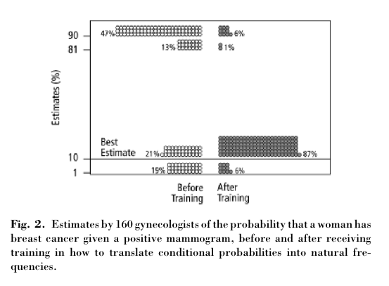
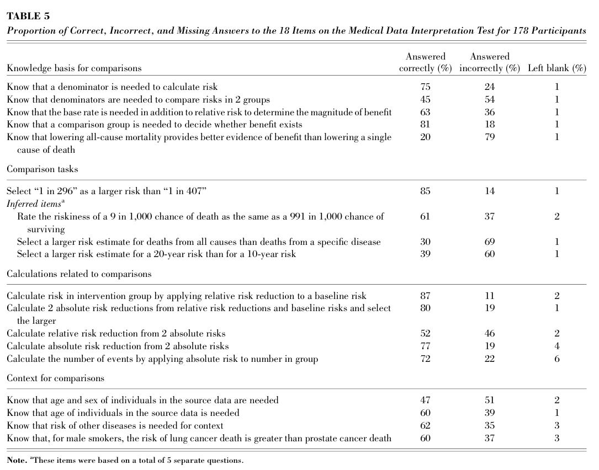
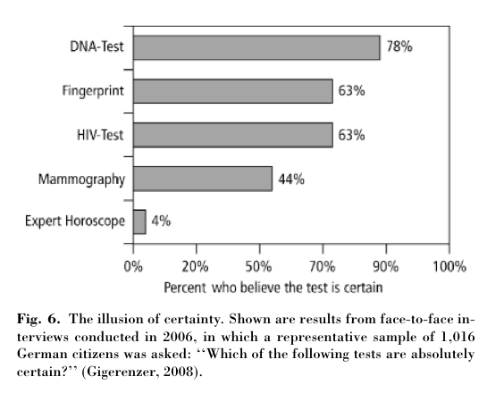
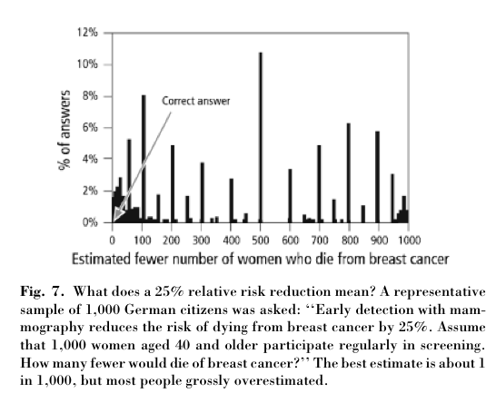
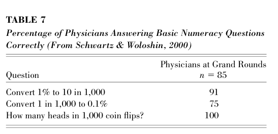

Epidemiology Notes 2012-11-08
=====================

### In the News

* Pertussis in the high school: <http://www.health.state.mn.us/divs/idepc/diseases/pertussis/pertparents.pdf>
* Stand up and exercise: [An experiment in rats](http://well.blogs.nytimes.com/2012/11/07/can-exercise-protect-the-brain-from-fatty-foods/?ref=health)
* [Tracking an outbreak: fungal infection](http://www.nytimes.com/2012/11/06/health/doctors-chased-clues-to-identify-meningitis-outbreak.html?ref=health)

### CAST Study

Why theory can mislead you.

### Essential Epidemiology, Ch. 11

* Levels of evidence [Table 11.1](http://dl.dropbox.com/u/5098197/Epidemiology/Figures/EE-Table-11-1.png)  Contrast this with the terminology used in the Osterholm article (which seems to be widely accepted): "Efficacy refers to the relative risk reduction attributed to vaccination as estimated from a randomised controlled trial, and effectiveness refers to the same measure of effect from an observational study." Lancet comment DOI:10.1016/S1473-3099(11)70295-X
* Forest plot.  This one shows the stratification of results: An example with birth weight and breast cancer risk: [Figure 11.3](http://dl.dropbox.com/u/5098197/Epidemiology/Figures/EE-Figure-11-3.png)
    * About this birth weight and breast cancer study ...
        * Difference between statistical significance and practical significance.
        * What's a significant result?  Relate to discussion of risk:
            * Is there an intervention that can change things?
            * How does the intervention compare in effect to risks we accept?
* Risks of including the same study twice.  Show an example with confidence intervals on an odds ratio.  Double the numbers and see the confidence interval get smaller.
* Criteria for inclusion of a study. [Table 11.2](http://dl.dropbox.com/u/5098197/Epidemiology/Figures/EE-Table-11-2.png) 
    * Give out this table to students along with the first page of the [Osterholm article](https://moodle.macalester.edu/file.php/350/Readings/flu.pdf) .  Ask how many of the criteria are met.

### Influenza Vaccine Meta-Study

Influenza vaccine study [Lancet article on the flu vaccine](https://moodle.macalester.edu/mod/resource/view.php?id=15256)

* Study selection: [Figure 1](http://dl.dropbox.com/u/5098197/Epidemiology/Figures/Osterholm-Lancet-Fig-1.png) 
* Forest plot: [Figure 2](http://dl.dropbox.com/u/5098197/Epidemiology/Figures/Osterholm-Lancet-Fig-2.png), note the log axes, which symmetrizes the confidence interval.
* All-cause mortality: [effects of confounding](http://dl.dropbox.com/u/5098197/Epidemiology/Figures/Osterholm-Lancet-Quote-1.pdf)  and reference to study that avoided healthy-patient confounding and got a much lower estimate of effectiveness.
* Larger studies needed to show [superiority rather than non-inferiority](http://dl.dropbox.com/u/5098197/Epidemiology/Figures/Osterholm-Lancet-Quote-2.pdf)
* Note: No estimate of the number of lives saved.  This will be our estimation project for the Thursday after Thanksgiving.

Gigerenzer
----------

### What do people know?

* Absolute versus relative risks
   * Relative is useful for detecting relationships
   * Absolute is essential for making personal decisions
* Reasons why screening tends to look better than it is
    * Lead-time bias
    * Overdiagnosis bias
* Examples of poor medical expression of risks
    * Risk of general anesthesia: "less than 1%"
    * People crave certainty
* Example with College endowment returns

Measuring Risk
-------------

Examples from the assignment:

* [One](https://moodle.macalester.edu/mod/assign/view.php?id=25737&sid=14132&gid=14132&plugin=onlinetext&action=viewpluginassignsubmission&returnaction=grading&returnparams=) Note that the exposure is typically regarded as yes/no rather than an intensity.
* [Two](https://moodle.macalester.edu/mod/assign/view.php?id=25737&sid=14174&gid=14174&plugin=onlinetext&action=viewpluginassignsubmission&returnaction=grading&returnparams=)
* [Three](https://moodle.macalester.edu/mod/assign/view.php?id=25737&sid=14198&gid=14198&plugin=onlinetext&action=viewpluginassignsubmission&returnaction=grading&returnparams=) Look at the calculation of unprotected sex.  The exposure is per person rather than per event or per year.

### General Principles
* Need to measure risks so that we can compare and prioritize them.  Do we need to put more resources into aviation safety?  How much will an investment improve things?  Child seats in cars?  In planes?  Preventive medicine?
* Be diligent in describing ways to stratify risk so that people can make effective decisions.  Don't average over irrelevant groups.  Try to find ways to capture "dose dependence."
* Watch out for "lifetime risk", which tends not be use useful for making individual decisions (but which might guide policy)

* Estimation Problem: Go through their risk estimates for college students.

#### Group Activity for Risk
For the following, come up with some measures of '''exposure''' to the risk and of important stratifying variables. As Gigerenzer puts it: 4 questions
* Risk of what?  I'm going to tell you this.
* Time frame?  (Generalize to measuring exposure, passenger miles, vehicle miles, ...)
* How big?
* Does it apply to me?

Risk areas:
* Car accidents
* Flying
* Exposure to mercury, or to lead.
* Exposure to radiation.
* Rape/violent crime
* Diabetes
* Alcohol
* Skiing/Mountain Climbing, etc.
* Prostate cancer or Breast cancer
* Stroke/cardiac disease
* Pneumonia/Flu

