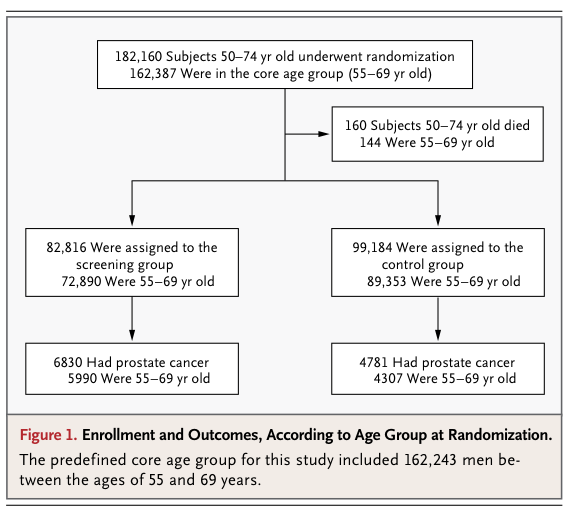

Epidemiology Notes 2012-11-27
=====================

In The News
---------------

* [Bed rail danger](http://www.nytimes.com/2012/11/26/health/after-dozens-of-deaths-inquiry-into-bed-rails.html?_r=0) --- heading toward trade-offs
* [Farish Jenkins obituary](http://www.economist.com/news/obituary/21566602-farish-jenkins-paleontologist-and-polymath-died-november-11th-aged-72-farish-jenkins)
* [Op-Ed on Mammography](http://www.nytimes.com/2012/11/22/opinion/cancer-survivor-or-victim-of-overdiagnosis.html?emc=eta1) and the [NEJM article](http://www.nejm.org/doi/full/10.1056/NEJMoa1206809?query=featured_home)
* [HIV testing recommended for all?](http://online.wsj.com/article/SB10001424127887324307204578129440065475224.html).  This will require that people understand what a positive test means.

### HIV ELISA

* Sensitivity: 99.9%
* Specificity: 99.8%
* Prevalence in a low-risk population: 2 in 10,000
* Prevalence in a high-risk population: 5%

Calculate the positive predictive value and the negative predictive value, that is
p( HIV | + test) and p( not HIV | - test )

### Main Points about Screening
* Comparing quality of tests must be done based on at least two numbers: sensitivity and specificity
* The prevalence of the condition sets the context. A test is better only if it provides better results in a given context. Test A might be better than test B in one setting, but the opposite might be true in another setting.
* "Loss function" --- what are the consequences of a false positive and a false negative?
* Biases that make screening look good:
    * Lead-time bias
    * Length bias
    * Assumptions about positive effects of an intervention: "I would have died if they hadn't detected it."
        Story about grad student in the MIT magnet lab in the 80s: detected a Berry aneurism. She died when being operated on. No way to know whether it was really a problem.
        
### Tabular Presentation

Test result | True| State
------------| ----| ------
     .      | Sick | Well
------------|-----|------
     Pos      | A   | B
     Neg      | C   | D 
     

* Sensitivity: $A/(A+C)$.  For the Sick people, what is the probability of a correct (positive) test result.
* Specificity: $D/(B+D)$. For the Well people, what is the probability of a correct (negative) test restul.
* Prevalence: $(A+C)/n$.  What fraction of the people are Sick
* Accuracy is not useful: $(A+D)/n$.  

### Activity on [Testing a Lie Detector](../Activities/testing-a-lie-detector.pdf)
        
### Calculations from Epiville

[Epiville Screening Case Study](http://epiville.ccnmtl.columbia.edu/screening/data_analysis.html)

### Prostate Cancer

#### [European Study]

* Read the abstract: especially the results section. 
    * Relative and absolute risk of death
    * Absolute risk reduction, together with false-positive rate means that 48 men would be treated to prevent one death.
    * Need a better measure than "treated" vs "deaths".  How are we supposed to compare the two.

* [NEJM article](http://www.nejm.org/doi/pdf/10.1056/NEJMoa0810084)

* It's a large study

* Cumulative Hazard is somewhat different between treatment and control groups.

* Age breakdown.  Note the multiple comparisons.

* Effect seems to be coming from the Swedish study.  Note that the p-values are all telling the same thing, except for the one excluding Sweden.

#### Preventive Services Task Force Recommendation

* [Statement for Consumers](http://www.uspreventiveservicestaskforce.org/prostatecancerscreening/prostatecancerfact.pdf)

* [Evidence Summary](http://www.uspreventiveservicestaskforce.org/prostatecancerscreening/prcascres.pdf)
    * Go through the "Structured Abstract"
    * Study selection
    * Go through three or four of the studies and discuss the ratings.
        * Note that several are criticized on the basis of low power.  When you fail to reject the null, there is a question of whether you failed because of no effect or because your study wasn't adequate.
    * Discussion
        * Contamination and non-compliance.
        * Prior PSA testing (maybe we're missing people with prostate cancer because they were previously screened out.)

### Receiver Operating Curve

President Garfield assassination

### Mad-Cow Disease

