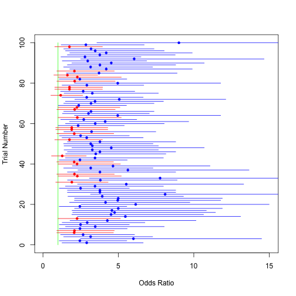

Power and Odds Ratios
========================================================

Consider a study with $n$ cases and $n$ controls, and an odds ratio of $R$.  Assuming that the two odds in the ratio are themselves reciprocals, with a value near $\sqrt{R}$, then it's as if the cases and controls are each drawn from a distribution with $n/(1+1/\sqrt{R})$ exposed cases with the remaining cases being unexposed.  Exposure is reversed for the controls.


```r
make.pop <- function(OR = 2, popsize = 10000) {
    cfrac = 1/(1 + sqrt(OR))
    crep = round(10000 * cfrac)
    arep = 10000 - crep
    cases = data.frame(exposed = c(rep("Exposed", arep), rep("Unexposed", crep)), 
        case = rep("Case", popsize))
    controls = data.frame(exposed = c(rep("Exposed", crep), rep("Unexposed", 
        arep)), case = rep("Control", popsize))
    pop = list(cases = cases, controls = controls)
    return(pop)
}
```


Standard odds ratio calculation with 95% CI

```r
OR.CI <- function(twobytwo) {
    a = twobytwo[1, 1]
    b = twobytwo[1, 2]
    c = twobytwo[2, 1]
    d = twobytwo[2, 2]
    OR = a * d/(c * b)
    se = sqrt(1/a + 1/b + 1/c + 1/d)
    ci = exp(log(OR) + 2 * se * c(-1, 1))
    return(list(OR = OR, lower = ci[1], upper = ci[2]))
}
```

Do a simulation of an odds ratio and it's CI:


```r
OR.simulate <- function(OR, ncases = 10, ncontrols = ncases, logscale = FALSE) {
    pop <- make.pop(OR = OR)
    if (logscale) 
        logscale = "x" else logscale = ""
    plot(1:2, xlim = c(0.05, 5 * OR), ylim = c(0, 100), type = "n", log = logscale, 
        xlab = "Odds Ratio", ylab = "Trial Number")
    lines(c(1, 1), c(0, 100), col = "green")
    failedcount = 0
    for (k in 1:100) {
        mydata <- rbind(sample(pop$cases, size = ncases), sample(pop$controls, 
            size = ncontrols))
        mytab = tally(~exposed & case, data = mydata)
        res = OR.CI(mytab)
        color = "red"
        if (res$lower > 1 || res$upper < 1) {
            color = "blue"
            failedcount = failedcount + 1
        }
        lines(c(res$lower, res$upper), c(k, k), col = color)
        points(res$OR, k, col = color, pch = 20)
    }
}
```


An example

```r
OR.simulate(OR = 3, ncases = 50)
```

 

}
